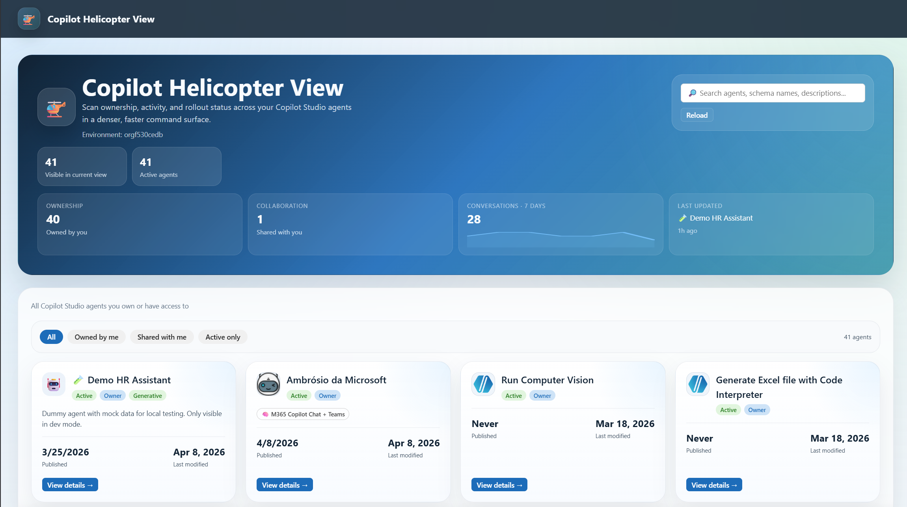
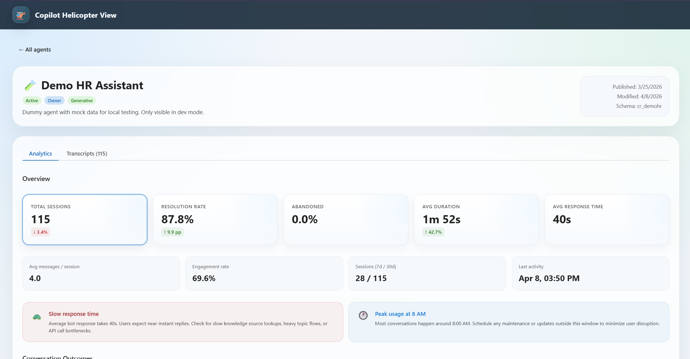
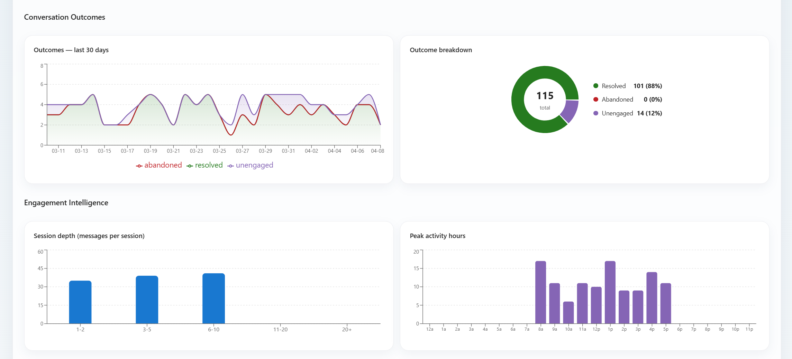
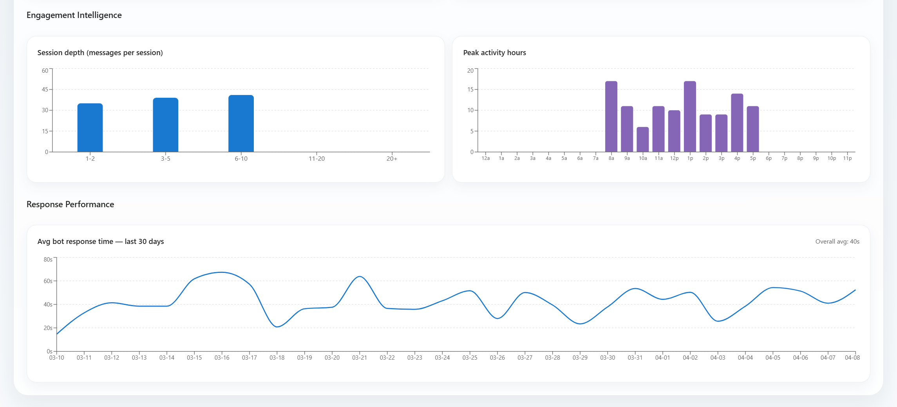
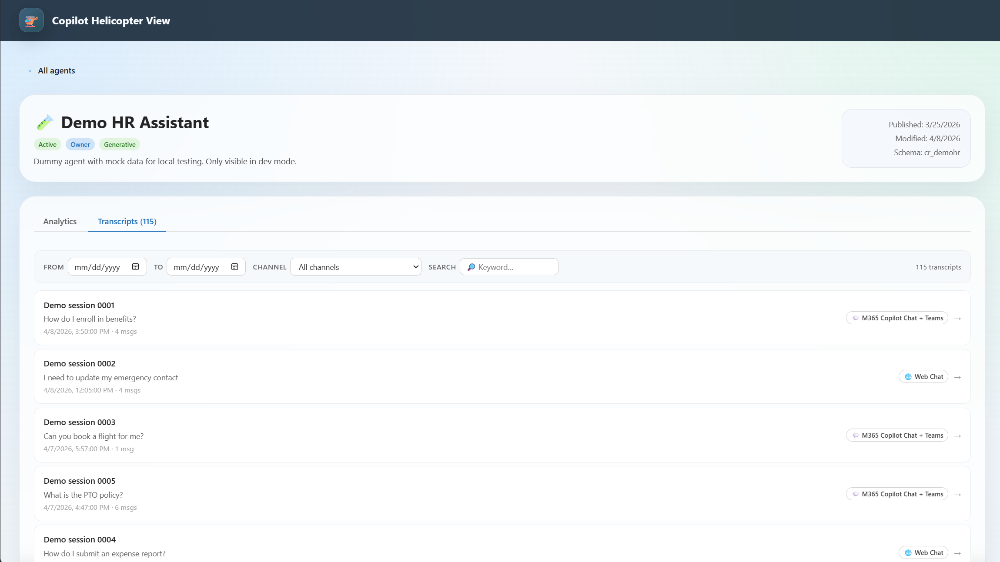
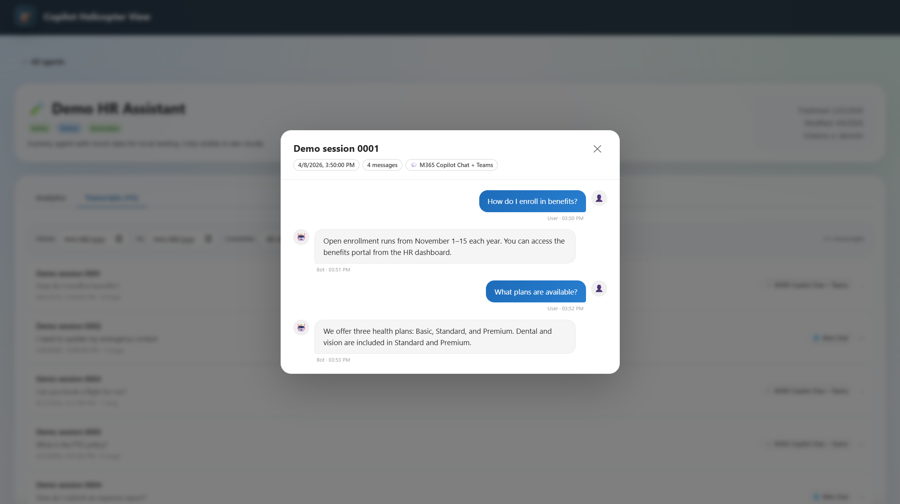

# 🚁 MyCopilotHelicopterView

Helicopter-view dashboard for all **Copilot Studio agents** in your Microsoft 365 tenant where you are **owner or co-owner** — with analytics and conversation transcripts in one place.

Two deliverables with aligned UX and shared data concepts:

|                       | Power App                                                       | Static Website                                             |
| --------------------- | --------------------------------------------------------------- | ---------------------------------------------------------- |
| **Stack**             | Power Apps Code Apps (Vite + React + @microsoft/power-apps)     | React 18 + TypeScript + Vite + Fluent UI v9                |
| **Auth**              | Power Platform native (AAD)                                     | MSAL.js v3 (popup/redirect)                                |
| **Data**              | Dataverse connector + `systemusers` lookup for owner label      | Dataverse Web API (delegated)                              |
| **Environment scope** | Single environment (the app's bound Power Platform environment) | Multi-environment (aggregates all accessible environments) |
| **Deployment**        | `power-apps push` to Power Platform environment                 | Docker container (nginx)                                   |

---

## Features

- **Dashboard** — grid of all accessible agents with status, role (owner/co-owner), transcript count, last modified
- **Filter** — All · Owned by me · Shared with me · Active only
- **Agent detail** — analytics panel (total, last 7 / 30 days, sessions-per-day bar chart) + transcript list
- **Transcript viewer** — inline chat-bubble rendering of Bot Framework Activity JSON
- **Security** — Dataverse row-level security is the authoritative boundary; the UI never leaks agents the user can't access

---

## Screenshots

### 1. Dashboard overview



The landing view gives operators a tenant or environment-level summary of accessible agents, including visible count, active count, ownership split, recent conversation volume, and last updated agent. The card grid below is the main operational surface for finding an agent quickly.

### 2. Agent detail overview



The agent detail page surfaces the core KPIs for a single agent: total sessions, resolution rate, abandonment, average duration, response time, engagement, and recent activity. This is the main diagnostic page when an owner wants to understand whether an agent is healthy or degrading.

### 3. Outcome and engagement analytics



Conversation outcomes are broken down across resolved, abandoned, and unengaged sessions, alongside distribution views such as message depth and peak activity hours. These charts help identify whether issues are quality-related, adoption-related, or simply driven by usage timing.

### 4. Response performance trends



This section focuses on engagement intelligence and response-time trends over time. It is useful for spotting slowdowns, usage spikes, and behavioral patterns that may point to orchestration issues, knowledge latency, or overloaded dependent systems.

### 5. Transcript catalog and filtering



The transcripts tab provides a searchable, filterable session index with date filtering, channel filtering, free-text search, and session counts. This supports investigation workflows where an owner needs to isolate a set of conversations by channel, timeframe, or keyword.

### 6. Transcript conversation drill-down



Selecting a transcript opens the conversation in a chat-style modal, preserving turn order and speaker context. This lets owners move from aggregate telemetry to the actual conversation content that explains why a metric moved.

---

## Quick Start

### Option A — Power App

```powershell
# Create local Power Apps config from template (first run)
cd powerapp
npm run code:bootstrap

# Keep databaseReferences unchanged (required for Dataverse data binding)

# Optional: verify config before publish
npm run validate:power-config

# Optional: verify the signed-in account can see Code Apps
npm run code:list

# Optional: initialize app metadata via CLI
npx power-apps init --display-name "Copilot Helicopter View" --environment-id <ENVIRONMENT_ID>

# Run locally
npm run dev

# Build and publish
npm run build
npm run code:push
```

See [powerapp/README.md](powerapp/README.md) for full instructions.

Note: this implementation is environment-scoped. It only shows agents in the environment the app is installed/bound to.

---

### Option B — Static Website (Docker)

#### 1. Azure App Registration

1. Go to [Entra admin center](https://entra.microsoft.com) → App registrations → New registration
2. Name: `CopilotHelicopterView`
3. Redirect URI: `http://localhost:5173` (for local) and your production URL
4. Under **API permissions** add delegated permissions:
   - Microsoft Graph → `User.Read`
   - Power Apps Service → `user_impersonation`
   - Dynamics CRM → `user_impersonation`
     Then grant admin consent (recommended).

#### 2. Configure & run

```bash
# Copy and fill in your values
cp webapp/.env.example webapp/.env
# Edit webapp/.env:
#   VITE_CLIENT_ID=<App Registration client ID>
#   VITE_TENANT_ID=<your tenant ID>

# Run with Docker Compose (builds + starts)
cd webapp
docker compose up --build

# Open http://localhost:5173
```

#### Local dev (no Docker)

```bash
cd webapp
npm install
cp .env.example .env   # fill in values
npm run dev            # http://localhost:5173
```

Note: this implementation is environment-agnostic. It discovers all environments the signed-in user can access and aggregates agents across them.

---

## Environment Scope Differences

Use this guide when deciding which implementation to use:

| Scenario                                                                   | Power App                                       | Webapp                     |
| -------------------------------------------------------------------------- | ----------------------------------------------- | -------------------------- |
| Need visibility across all environments in a tenant                        | Not suitable (single environment)               | Recommended                |
| Need a solution fully hosted inside Power Platform environment lifecycle   | Recommended                                     | Not primary goal           |
| Need central operations dashboard for owners/co-owners across environments | Limited                                         | Recommended                |
| Environment-to-environment rollout isolation                               | Strong (each app instance is environment-bound) | Centralized view by design |

Why both exist:

- Power App aligns with environment-bound app governance and deployment.
- Webapp provides tenant-wide operational visibility with environment fan-out.
- Both maintain the same ownership and transcript semantics, but differ in scope boundary.

---

## Project Structure

```
MyCopilotHelicopterView/
├── .azure/deployment-plan.md
├── powerapp/
│   ├── README.md                  # Code Apps setup guide
│   ├── package.json               # npm scripts + @microsoft/power-apps
│   ├── power.config.example.json  # template for local tenant/environment config
│   ├── power.config.json          # local file (gitignored)
│   └── src/
│       └── App.tsx                # Code-first app shell and feature entry point
└── webapp/
    ├── src/
    │   ├── auth/                  # MSAL config + AuthProvider (login gate)
    │   ├── services/              # dataverseService.ts — typed Dataverse Web API calls
    │   ├── hooks/                 # useAgents, useTranscripts, useAnalytics, useCurrentUser
    │   ├── components/            # AgentCard, AgentGrid, AnalyticsPanel, TranscriptViewer
    │   ├── pages/                 # Dashboard, AgentDetail
    │   ├── types/index.ts         # CopilotAgent, ConversationTranscript, …
    │   └── App.tsx                # Router + top bar + QueryClient
    ├── Dockerfile                 # Multi-stage: node:20-alpine → nginx:alpine
    ├── nginx.conf                 # SPA routing + security headers
    └── docker-compose.yml
```

---

## Data Model

Both parts use the same primary Dataverse entities:

| Entity                    | Path                                     | Used for                                                  |
| ------------------------- | ---------------------------------------- | --------------------------------------------------------- |
| `bots`                    | `/api/data/v9.2/bots`                    | Agent list (Dataverse RLS scopes to accessible records)   |
| `conversationtranscripts` | `/api/data/v9.2/conversationtranscripts` | Session transcripts + analytics derivation                |
| `WhoAmI()`                | `/api/data/v9.2/WhoAmI()`                | Resolve current user's `systemuserid` for owner labelling |

For the Power App, the app also reads `systemusers` to map the host Entra user to the Dataverse `systemuserid` used by bot ownership.

**Owner vs co-owner**: Dataverse implicit row-level security is the security boundary — users only ever see agents they can read. The `isOwner` flag is cosmetic only and is computed by comparing the current Dataverse `systemuserid` against bot owner fields (`_owninguser_value` and `_ownerid_value`).

**Environment scope**:

- The webapp can aggregate and filter across multiple accessible Power Platform environments.
- The Power App Code App is intentionally scoped to its current environment only.

---

## Customisation

| What                      | Where                                                                           |
| ------------------------- | ------------------------------------------------------------------------------- |
| Theme colour              | `webapp/src/App.tsx` for web app, or `powerapp/src/App.css` for Code App        |
| Analytics date window     | `useAnalytics.ts` → change `MS_30D` constant                                    |
| Max transcripts per agent | `dataverseService.ts` → `$top=200` query param                                  |
| Additional agent columns  | Add to `$select` in `getAgentsForEnvironment()` and to `CopilotAgent` interface |
